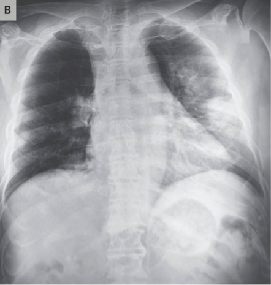

# COVID-19-detection

# Problem
COVID-19 is spreading at an unprecedented rate all around the globe. Health care systems are experiencing a tremendous amount of pressure and health professionals work on exhausting shifts to deal with the demand. As patients flood clinics and hospitals for a checkup to see if they have the virus, it becomes a burden for the doctors to check all the incoming patients since It’s impossible to know without a test. While carrying out the test using CT scan images, a drawback is that the analysis requires an expert and takes significant time — which is precious when people are sick around the world.

# Dataset
The dataset used in this project was the x-ray images of both healthy and COVID-19 infected patient Chest. Dataset for this project was acquired from Kaggle. Data and labels were converted to NumPy arrays, one-hot encoding was
done to the labels and the data was partitioned into using 80% for training
and 20% for testing.

The image shown below is an example of a patient with positive Covid-19.

The image shown below is an example of a healthy individual.

# System Architecture
In the development of our model we used Convolutional Neural Network
Architecture called VGG-16 using Keras, Tensorflow, and Deep Learning.
VGG-16 is a convolutional neural network architecture, it’s named VGG-16
comes from the fact that it has 16 layers. Its layers consist of Convolutional
layers, Max Pooling layers, Activation layers, Fully connected layers.

# Model Creation and Training
The generated model can classify if a patient has COVID-19 or not based on the
images of his/her Chest X-Ray. We construct the head model that gets placed on
top of the base model. For the head model we first start by considering it as
output of the base model. Then we averagePool it with a size of 4*4 which down
samples it to an average value in that square. Next, we flatten the head model
and create a dense layer and use relu as the activation function. Lastly, we have
added a Dropout layer which prevents our model from overfitting.
For the training process, we have set the learning rate of 3 for 600 epochs with
the Batch size of 100 samples per training pass.

# Use Cases
The model can be used by Doctors to accelerate their process of detecting
if a patient is suffering from COVID-19 or not.

Radiologists and healthcare workers are at the risk of contracting the
virus; this model can be used even without them and in turn preserving
them.

This would give physicians an edge and allow them to act with more
confidence while they wait for the analysis of a radiologist by having a
digital second opinion confirm their assessment of a patient's condition.

Also, these tools can provide quantitative scores to consider and use in
studies. Image data linked with clinically relevant attributes in a public
dataset that is designed for ML will enable parallel development of these
tools and rapid local validation of models.

Furthermore, this data can be used for completely different tasks.

